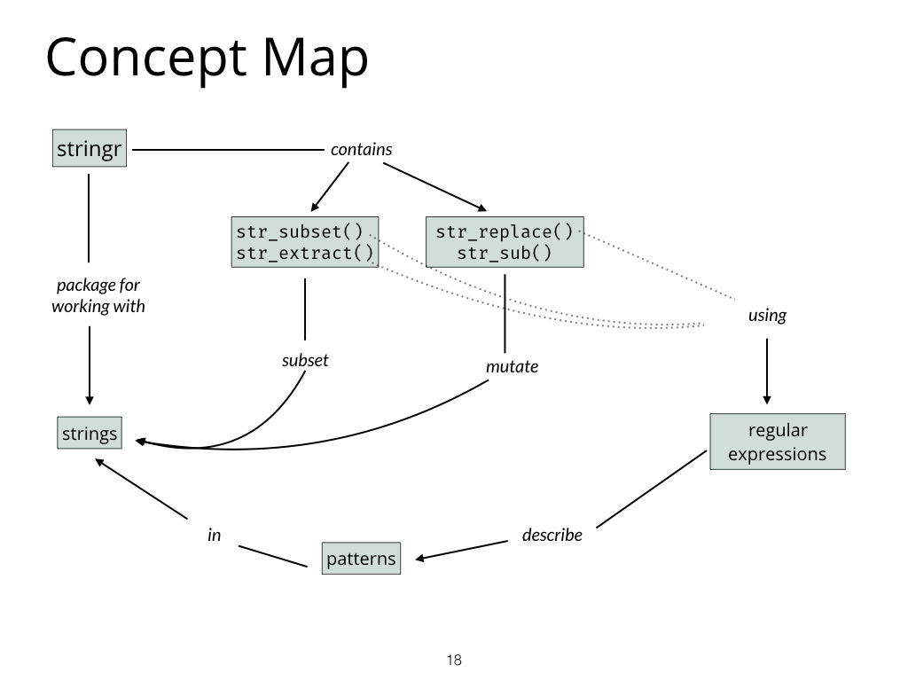

# RStudio Certified Instructor Teaching Exam

A 15 minute lesson on how to manipulate strings with four functions from the stringr package.

## Concept Map

## Learner Persona

Sam is Masters student studying chemistry and has been learning R in her free time. She is interested in computational linguistics and just finished taking a Natural Language Processing course online where she learned about regular expressions. She knows that most real world natural language data is very messy. She wants to learn how she can extend what she learned in the online course to start working with text in R. She feels a bit out of her comfort zone but is excited to see what she can do.

## Resources

* The stringr [documentation](https://stringr.tidyverse.org/reference/index.html)
* Official stringr [cheatsheet](stringr-cheatsheet.pdf)
* ["Introduction to stringr"](https://stringr.tidyverse.org/articles/stringr.html) vignette
* The [Strings](https://r4ds.had.co.nz/strings.html) Chapter in R for Data Science

